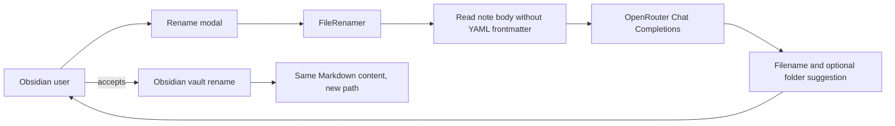

# Denali AI Renamer — Architecture

Version: `5.0.4`

## Product boundary

Denali proposes filenames for Markdown notes and renames files after the user accepts the proposal. It does not generate, read for AI context, add, update, or remove frontmatter. The YAML block at the top of a note is removed from the request input. Renaming never rewrites note contents.

## Components

## Rename flow

1. The user starts a single-note or folder rename from an Obsidian command or context menu.
2. Denali reads a Markdown file and removes an opening YAML frontmatter block from the AI input.
3. Denali sends the body text to OpenRouter and parses a JSON filename suggestion. An optional relative folder suggestion is used only when the user enabled auto-subfolder; absolute paths, traversal segments, and invalid path characters are rejected.
4. Interactive mode allows the user to edit the proposed filename. Automatic mode applies the filename directly according to its configured naming preferences.
5. Denali checks for path collisions, skips a no-op rename before charging, creates a missing safe destination folder when needed, optionally creates a backup, and renames through Obsidian's vault API. It does not call `processFrontMatter` or modify note contents.

## Settings and services

- OpenRouter model and key settings control filename requests. The existing managed encrypted-key fallback and user-entered key behavior remain for this purpose.
- Constance account and credit services authorize the existing one-time rename credit flow.
- Backup and log settings affect rename recovery and diagnostics only.
- Old frontmatter preference values in an existing settings file are unused and are not exposed in the settings UI.

## Build and publish staging

`MyHelloWorldPlugin/main.ts` is the source entry point. `npm run build` creates `publish/main.js`; the source, manifest, styles, and public documentation are mirrored into `publish/`. Building the staging bundle does not publish it to Obsidian or to the public repository.
